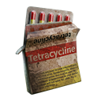
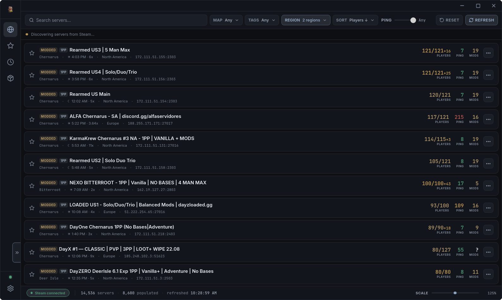
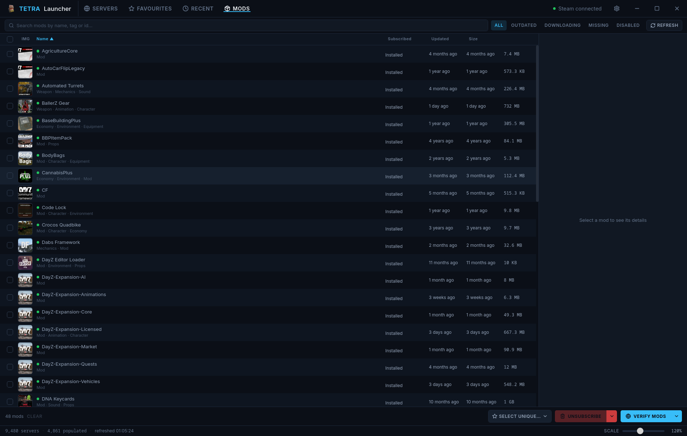

<div align="center">



# TETRA LAUNCHER

**Find the server. Trust the mod list.**

A DayZ server browser and Workshop mod manager for Windows and Linux —
free, open source, and built around one idea: check the mods *before*
you connect, not after.

[**tetralauncher.com**](https://tetralauncher.com) · [Download](https://tetralauncher.com/download.html) · [Changelog](CHANGELOG.md)

[](https://github.com/HellboundGlory/dayz-launcher/actions/workflows/check.yml)
[](https://github.com/HellboundGlory/dayz-launcher/releases/latest)
[](LICENSE)

</div>

<br/>



## What it does

**`[BROWSE]` Server browser** — Filter by map, tags, region and ping. Hide
empty, full, locked or offline servers. Favourites and Recently Played, kept
on your machine — your server list is nobody's business but yours.

**`[VERIFY]` Verify & Join** — Re-reads a server's mod list live and checks
the Workshop directly before launching — not Steam's cached "needs update"
bit, which can be stale by the time you click Join.

**`[MANAGE]` Mod manager** — See every subscribed mod, which of your
favourite servers need it, and reinstall a corrupted copy in one click —
without hunting through Steam's Workshop pages.

**`[SIGNAL]` Discord presence** — Shows the server you're playing on in
Discord, with a one-click way for friends to join you straight from your
profile.



## Get it

**[tetralauncher.com/download.html](https://tetralauncher.com/download.html)** always has the current release for every platform:

- **Windows** — installer or a portable `.zip`
- **Linux** — AppImage or `.deb`

The launcher checks for updates itself once installed (portable copies notify with a link instead of auto-installing).

## Building from source

Requires a stable Rust toolchain and Node.js.

```bash
npm ci
npx tauri build --debug
```

**Use `npx tauri build --debug`, not plain `cargo build`.** Both write to the
same path, but a plain `cargo build` resolves the dev server URL instead of
the bundled frontend, so the result opens on "localhost refused to connect."

To check the code without producing a binary:

```bash
cargo fmt --all --check
cargo clippy --workspace --all-targets -- -D warnings
cargo test --workspace
npx tsc --noEmit
```

These four are exactly what CI runs on every push — see
[`.github/workflows/check.yml`](.github/workflows/check.yml).

The workspace is a Tauri v2 app: a Rust backend split into five crates
(`tetra-core`, `tetra-net`, `tetra-registry`, `tetra-steam`, `tetra-launch`,
plus `tetra-discord` for Rich Presence) behind a React + Vite frontend. It
compiles and ships on both Windows and Linux — Windows-only code (Steam
registry discovery, the `dzsa://` protocol handler on that platform) is
`cfg(windows)`-gated, with a Linux equivalent where one exists.

## Contributing

Issues and pull requests are welcome. If you're touching anything under
`.ai/`, run `npm run repoos:generate` in the same change — `CLAUDE.md` is
generated from it and CI fails on drift.

## License

[MIT](LICENSE) · Not affiliated with Bohemia Interactive.
