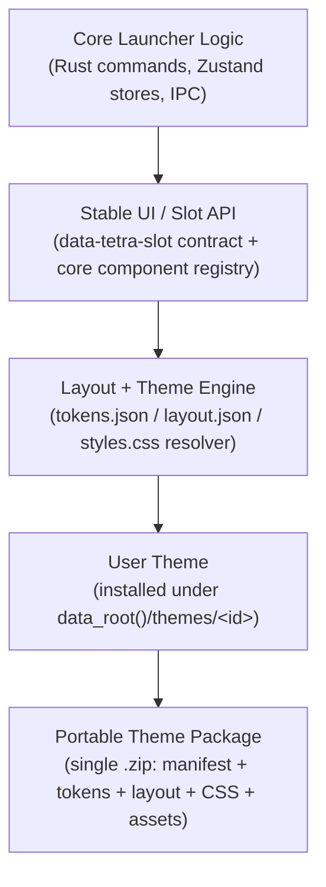
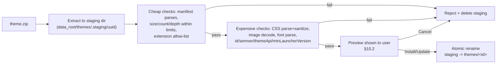

# Tetra Launcher — Theming & Layout Customization System

**Status: IMPLEMENTED (Phase 3.6, merged to `main` 2026-09-15).** This
document was the original deliverable requested for a fully portable,
exportable/importable UI customization system, grounded in a direct audit of
this repository (file:line citations throughout, now historical — some may
have drifted from current line numbers) plus research into comparable
systems (Playnite, VS Code, Obsidian, BetterDiscord/Vencord, Home Assistant
Lovelace, Shopify theme sections). Kept post-implementation as the design
rationale record (security model, versioning, slot-contract reasoning) —
where it describes concrete implementation choices, prefer `docs/adr/` and
the current code, since a few specifics (e.g. §3.2's `retryAction`
required/optional call) were deliberately overridden during implementation
without editing this document.

## How to read this document

The request enumerated 31 required deliverables. Rather than answer them as a
flat checklist, they're folded into 16 sections below. This table is the
traceability map — every numbered ask lands somewhere.

| # | Ask | Section |
|---|---|---|
| 1–3 | Current architecture, coupling points, limitations | §1 |
| 4–6 | Research, comparison, recommended architecture | §2 |
| 7 | Logic/presentation separation | §3 |
| 8–9 | Theme API, stable slot/component system | §3 |
| 10 | Layout customization architecture | §4 |
| 11 | Styling architecture | §5 |
| 12–14 | Package format, manifest schema, slot referencing | §6 |
| 15–18 | Versioning, back/forward compat, fallback | §7 |
| 19 | Security model | §8 |
| 20 | Theme developer workflow | §9 |
| 21, 26 | Management UI, mockups | §10 |
| 22–25 | Export/import architecture, validation, asset handling | §11 |
| 27 | Example themes | §12 |
| 28 | Files needing modification | §13 |
| 29 | Risks and tradeoffs | §13 |
| 30 | Testing strategy | §14 |
| 31 | Phased roadmap | §15 |
| — | Decisions recorded this session (settings.* scope, visual editor) | §16 |

---

## 1. Current Architecture: Facts, Coupling, Limitations

### 1.1 What exists today

Tetra Launcher's frontend is a **single-page, non-routed shell**. `src/App.tsx`
(743 lines) is the sole composition root — there is no router (`src/routes/`
exists but is an empty, unused directory). View switching is one
`useState<ViewId>` (`'servers'|'fav'|'recent'|'mods'`, `App.tsx:70`). The
render tree (`App.tsx:604-742`) is a fixed shape:

```
.relative.flex.h-screen shell (App.tsx:605-608, exposes --side-w)
├─ WindowResizeHandles (609)
└─ flex row (611-718)
   ├─ Sidebar (612-620)            — 220px⇄52px rail, hardcoded NAV array
   └─ flex column (622-717)
      ├─ WindowControls (623)      — 28px titlebar
      ├─ update banner (626-650)   — inline JSX, not a component
      ├─ activeView ternary (652-709)
      │  ├─ "mods"    → ModsTab (654)
      │  └─ "servers" → FilterBar + banners + status strip + ServerList
      └─ FooterBar (711-716)
+ 6 modal siblings after the row (720-740): SettingsView, OnboardingModal,
  UpdateModal, ServerInfoModal, ModFilterModal, SteamRequiredModal
```

Every one of the ~20 components in `src/components/` is hand-written JSX with
literal Tailwind utility classes. There is **no data-driven or config-driven
layout anywhere in the codebase today** — sidebar width, row height
(`server-list.tsx` `estimateSize: () => 48`), modal width
(`server-info-modal.tsx:102`), grid column counts (`:134`
`grid-cols-3`), and region visibility (the `activeView` ternary itself) are
compile-time JSX literals. Changing any of them requires editing source and
rebuilding.

### 1.2 The one genuine extensibility seam: color theming

`src/theme/{palette,apply,theme-store}.ts` is a real, working, already-shipped
runtime theme engine, and it is the correct foundation to extend rather than
replace:

- **`palette.ts`** — pure color math (hex/rgb/hsl conversions, WCAG
  `contrast()`, `deriveLight()` which derives a light palette from dark at a
  4.5:1 contrast floor), 12 `Token`s, 6 built-in `Preset`s.
- **`apply.ts`** — `applyTheme(palette, scheme, bloom)` writes ~22 CSS custom
  properties directly onto `document.documentElement.style` and computes the
  5-layer `--glow` box-shadow in JS (not `calc()`, because WebKitGTK drops
  that multiplication — a real, hard-won constraint, see `apply.ts:41-43` and
  `DESIGN.md` §18).
- **`theme-store.ts`** — Zustand store; user-created "skins" persist to
  `localStorage["tetra.customThemes"]`, active selection to a separate
  `localStorage` key. `tailwind.config.js:9-38` maps every semantic Tailwind
  color utility (`bg-accent`, `text-danger`, …) to `var(--token)`, so
  **switching a theme costs one style write and zero re-renders** — no
  rebuild, no React re-render tree walk.

This pattern — tokens as CSS custom properties, rewritten at runtime, read by
static Tailwind classes — is the single most important existing asset for
this proposal. It already solves the hardest part of "customize without
forking": components never carry raw values, only `var()` references.

### 1.3 Coupling points that block anything beyond color

1. **Layout is not data.** Nothing separates "what to render" from "how it's
   arranged." A user cannot move the sidebar, reorder a server row's fields,
   or hide a footer stat without editing `.tsx` files.
2. **Two components bypass theming entirely.** `update-modal.tsx:51-159` and
   `steam-required-modal.tsx:95-161` use literal hex colors, not `var()`
   tokens — even today's color-only theming has gaps that a broader system
   inherits unless fixed first.
3. **No stable selector contract.** Board-vocabulary class names like
   `.l2-row`, `.fdrop`, `.sec`, `.footer-v2` (seen throughout
   `sidebar.tsx`/`filter-bar.tsx`/`footer-bar.tsx`) have **zero matching CSS
   rules** — confirmed via grep across `src/`. They're markers with no
   contract behind them. A future advanced-CSS theme has nothing durable to
   target; internal Tailwind-generated utility strings are not a stable API
   and will drift on every refactor.
4. **Tailwind's static extraction is a hard constraint.**
   `tailwind.config.js:6` content-scans only `src/**/*.{ts,tsx}` and
   `index.html` at *build* time. Any Tailwind class name chosen at *runtime*
   (by a user or a theme file) is not in that scan and gets **purged from the
   production CSS bundle** — it silently renders as nothing. This rules out
   an entire category of "let users type Tailwind classes" designs. Every
   runtime-configurable value must be a CSS custom property or an inline
   style — exactly the trick the existing color engine already uses, and the
   reason the design below never lets a theme choose a class name.
5. **No persistence surface fit for portable, file-based packages.**
   Installed "skins" live in `localStorage` — browser-profile storage, not a
   file, not exportable as-is, and irrelevant to fonts/images/CSS which must
   be real files on disk regardless.
6. **Backend has zero infrastructure for this.** Confirmed by direct
   backend audit: no zip/archive crate anywhere in the workspace (root
   `Cargo.toml`, `src-tauri/Cargo.toml`, all `crates/tetra-*/Cargo.toml`), no
   `tauri-plugin-fs` (explicitly removed — see `src-tauri/Cargo.toml:19-22`
   comment: "`os`, `fs`, and `store` plugins were previously registered with
   zero call sites and were removed"), no custom URI-scheme protocol
   registered for the webview (`protocol.rs` only parses the OS-level
   `dzsa://connect/...` deep link from argv — irrelevant to in-webview asset
   loading), and a CSP (`tauri.conf.json:45`) that permits `img-src` only
   `'self' data: https://images.steamusercontent.com` — no local runtime
   file loading path exists today because none has ever been needed (all
   images/fonts are Vite build-time imports, compiled into `dist/`).
7. **`capabilities/default.json`** grants no `fs:*` and no
   `dialog:allow-save` — only `dialog:allow-open` and a narrow window/process
   permission set. Any import/export flow needs new, deliberately narrow
   capability grants, not a broad filesystem permission.

None of this is a criticism of the current code — it's a normal launcher that
was never asked to support third-party presentation packages. It does mean
the feature is close to greenfield on the backend and needs to be built
carefully so it doesn't compromise the CSP/capability discipline already in
place (which is good discipline worth preserving).

---

## 2. Research and Recommended Architecture

### 2.1 What comparable systems do, and what breaks

| System | Model | What works | What breaks / risk |
|---|---|---|---|
| **VS Code** color themes | JSON, declarative, no code | Simple, safe by construction | Only a color theme — layout is a separate, code-executing "extension" with **full user-level privilege, no sandbox**; researchers confirm any extension, however innocuous its manifest looks, can read files/spawn processes/exfiltrate data, and this has been exploited via typosquatted "theme" extensions |
| **Obsidian** | CSS snippets (styling only) vs. plugins (full JS, no sandbox) | Clean split: pure-CSS themes are "very low risk" by the language's own limits; plugins are explicitly the high-trust tier | No permission model at all for plugins — `manifest.json` is metadata, not a capability declaration; security is 100% "trust the author" |
| **Playnite** | Themes are full WPF/XAML — code-adjacent markup+bindings | Enormous creative freedom (this is the most "near-total freedom" precedent that exists) | Themes can break app startup if required resource keys (`TextBrush`, `MainWindowStyle`, …) are missing — Playnite's own docs warn "if you edit the default files, you risk breaking the application's ability to start." No sandboxing; a broken theme is a broken app until reverted. |
| **BetterDiscord / Vencord** | CSS themes + JS plugins | Pure CSS is safe against code exec; still enables UI redressing (fake overlays, hidden warnings via `position`/`opacity` tricks) | Confirms CSS alone is not risk-free even without script execution — must design against redressing, not just against code injection |
| **Home Assistant Lovelace** | Declarative YAML/JSON config → registry of Web Components (`window.customCards`) | The strongest precedent for "high customization freedom with zero arbitrary markup" — dashboards are pure config, cards subscribe to real state | Custom *cards* are still arbitrary JS modules (an opt-in, separate, higher-trust extension point) — the config layer itself is exactly what we want to copy |
| **Shopify theme sections/blocks** | `` JSON declares typed settings; merchant gets a generated, bounded editor UI | "Because the schema dictates the available inputs, the merchant's experience is strictly limited to the options you define, ensuring they cannot accidentally break the layout" — this is precisely the future-compatibility property we need | Requires the app (not the theme) to own every renderable primitive — a discipline, not a limitation, for us |

### 2.2 The one fact that decides the architecture

Constructable stylesheets / `adoptedStyleSheets` do **not** bypass CSP
`style-src` (verified against current spec behavior — an earlier assumption
in this research that they did was wrong and is corrected here). Only two
paths exist for delivering theme CSS under a strict CSP:

1. Weaken `style-src` with `'unsafe-inline'` (script-src untouched) — works,
   but is a blanket grant with no per-theme scoping.
2. **Serve the theme's CSS as a real external stylesheet from a narrowly
   scoped custom protocol** (`<link rel="stylesheet" href="tetra-theme://…">`)
   and add only that scheme to `style-src`/`img-src`/`font-src`. This is
   *not* `'unsafe-inline'` — it's an origin allow-list, the same mechanism
   Tauri's own `asset:` protocol uses, scoped read-only to one installed
   theme's directory.

**This proposal uses path 2.** It keeps `script-src` exactly as strict as it
is today (`'self'`, no `'unsafe-inline'`/`'unsafe-eval'` ever), and it means a
theme's CSS is real, parseable, interceptable CSS — not a string blindly
trusted into the DOM — which is what makes server-side (Rust) CSS
sanitization at import time meaningful (§8).

Meanwhile, the existing color-token mechanism (`element.style.setProperty()`)
already works precisely *because* direct CSSOM property mutation from script
is not subject to `style-src` at all (it isn't HTML/CSS text being parsed) —
this is why `apply.ts` needs no CSP changes today, and it's the reason Tier 1
theming (§4) needs zero CSP changes tomorrow either.

### 2.3 Recommended architecture

**A layered, declarative, capability-scoped theme engine — extending the
existing token engine rather than replacing it — with zero theme-authored
code execution at any tier.**



Three tiers, all exportable, all declarative, none requiring source edits to
the launcher and none capable of executing script:

- **Basic** — design tokens only (colors, spacing, radii, shadows, font
  refs). Direct superset of what exists today.
- **Advanced** — + a layout manifest (visibility/order/size/position for a
  fixed registry of named slots) + custom CSS (sanitized, scoped, linked via
  the custom protocol) + bundled fonts/images.
- **Expert** — + declarative component *composition* inside specific
  high-value slots (server row, mod row), built only from a fixed primitive
  registry (`box`, `stack`, `text`, `icon`, and `core` references to
  launcher-owned content) — never raw markup, never a template language with
  logic/eval.

This directly answers the brief's instruction *not* to assume raw CSS/HTML
injection is the answer: raw CSS is allowed (sanitized, scoped, tier 2+),
raw HTML is never allowed, at any tier.

---

## 3. Logic/Presentation Separation and the Slot Contract

### 3.1 The contract

> **Themes configure how core-rendered content is arranged and styled. They
> never supply the content, and they never touch business logic, state, or
> IPC.**

Concretely: every region a theme can affect is a **slot** — a stable string
ID attached to real DOM via a `data-tetra-slot="…"` attribute, rendered by
core React code reading real Zustand stores exactly as today. A theme's
`layout.json` can say "make `server.row` denser, put `ping` before `players`,
hide the `tags` sub-line" — it can never say "put a fake element that looks
like a Join button here" because there is no primitive for arbitrary content,
only positioning/visibility of core-defined children.

This is why `src/lib/tauri.ts` (the IPC binding layer) and every Zustand
store in `src/stores/`/`src/theme/` remain **completely untouched** by this
proposal's runtime contract — a theme file is never given a reference to
them, directly or indirectly.

### 3.2 The stable slot registry

New module `src/theme/slots.ts` — the single source of truth for what is
themeable, what's required vs. optional, and since when:

```ts
export interface SlotChild {
  id: string;            // "joinAction", "pingBadge", "name", …
  required: boolean;     // true = core always renders it; theme may not hide it
  since: string;         // themeApi version this child was introduced in
}

export interface Slot {
  id: string;             // "server.row", "sidebar.nav", "shell.footer", …
  children: SlotChild[];
  themeable: "full" | "tokensOnly"; // "tokensOnly" = colors/fonts apply, layout does not
}
```

**Coverage is total. No exceptions.** Every component
audited in section 1 (all ~20 files under `src/components/`) gets slot IDs in
`slots.ts` — the server browser is not special-cased, it's just the first one
worked through in examples above. Concretely, this is the full slot map this
proposal commits to (not "illustrative", the actual initial registry):

| Slot ID | Required children | Optional children | `themeable` | Expert composition |
|---|---|---|---|---|
| `shell.sidebar` | `navList`, `settingsEntry` | `collapseToggle`, `logo` | `full` | full |
| `shell.header` | `windowControls` | `dragRegion` | `full` | full (container position pinned top — §4.3) |
| `shell.footer` | `steamStateChip` | `serverCounts`, `uiScaleSlider` | `full` | full |
| `filterBar` | `searchInput`, `refreshAction` | `mapFilter`, `tagsFilter`, `sortControl`, `pingSlider` | `full` | full |
| `server.row` | `name`, `joinAction`, `modStatusBadge` | `pingBadge`, `playerCount`, `tagsLine`, `regionFlag` | `full` | full |
| `server.rowActions` | `joinAction` | `moreInfoItem`, `loadToMenuItem`, `downloadModsItem` | `full` | full |
| `modal.serverInfo` | `closeAction`, `joinAction` | `statGrid`, `readinessStrip`, `propsList` | `full` | full |
| `modal.modFilter` | `closeAction`, `applyAction` | `tabStrip`, `previewPane` | `full` | full |
| `mods.toolbar` | `searchInput`, `refreshAction` | `statusFilter` | `full` | full |
| `mods.row` | `modName`, `modStatusBadge` | `sizeLabel`, `usageCount` | `full` | full |
| `mods.inspector` | `closeAction` | `detailFields` | `full` | full |
| `modal.onboarding` | `primaryAction` | `pathBrowser` | `full` | **restricted — Advanced ceiling** |
| `modal.update` | `closeAction`, `installAction` | `changelogView` | `full` | full |
| `modal.steamRequired` | `retryAction` | `errorCopy` | `full` | **restricted — Advanced ceiling** |
| `settings.*` | *(all)* | *(none)* | `full` | **restricted — Advanced ceiling** |

In plain terms: yes, the Mods tab (toolbar, rows, inspector), every modal,
the sidebar/navigation, the filter bar, the footer, **and Settings itself**
are all layout- and CSS-themeable at Advanced/Expert tier, exactly like the
server browser — every row in the table above is `full`. There is no locked
slot anywhere in the launcher.

**"Expert composition" is a separate ceiling from `themeable`, added after
the original design session** (see §4.3, §16.1/ADR-0001): three slots —
`modal.onboarding`, `modal.steamRequired`, `settings.*` — stay `full` for
ordinary layout (visibility/order/size, same as every other slot) but cannot
receive an Expert-tier composition file, free positioning, or decorative
images. These are recovery/configuration surfaces where a layout that looks
*plausible* but subtly buries a Retry/Save action causes real harm without
necessarily tripping the Theme Activation Safety Window (§7.4), which only
catches themes that render as visibly broken.

`"tokensOnly"` remains a legal value of `Slot.themeable` (kept in the type for
a future screen that might need it — e.g. a legal/EULA notice), but nothing
in the initial registry uses it. The recovery guarantee this exception used
to provide doesn't disappear — it moves to a purpose-built mechanism instead
of a locked slot: the **Theme Activation Safety Window** (§7.4), which also
closes a gap the locked-slot approach had (a theme could leave Settings'
internals untouched yet still hide the sidebar's Settings *entry point* —
`shell.sidebar` was always `full` — and the old design didn't protect
against that).

### 3.3 Why "required vs. optional" is the future-compatibility mechanism

When core adds a new required child to an existing slot (the brief's example:
a queue-position badge added to `server.rowActions` six months from now), the
renderer resolves a slot in two passes:

1. Render every child the theme's `layout.json`/component-composition JSON
   explicitly placed, in the position/order it specified.
2. **Any required child the app defines that the theme's file never
   mentions gets appended, in a default position, automatically** — the
   theme cannot "consume" the whole slot and thereby swallow new required
   content, because the resolver walks the *current* required-children list
   from `slots.ts`, not the theme's list.

An old theme authored before the queue badge existed continues to compile and
render; the queue badge just shows up in a sane default spot the first time
the user runs the new launcher version, with no theme update required. This
is the direct, concrete answer to deliverable #17.

---

## 4. Layout Customization Architecture

### 4.1 `layout.json` — advanced tier

A layout manifest is a flat map from slot ID to a small, closed set of
parameters — never free-form code, never a class name (Tailwind-purge
constraint, §1.3):

```json
{
  "schemaVersion": 1,
  "slots": {
    "shell.sidebar": {
      "position": "left",
      "width": "240px",
      "collapsedWidth": "56px",
      "defaultCollapsed": false
    },
    "server.row": {
      "density": "compact",
      "order": ["name", "tagsLine", "regionFlag", "pingBadge", "playerCount"],
      "hidden": ["tagsLine"]
    },
    "shell.footer": {
      "hidden": ["uiScaleSlider"]
    }
  }
}
```

Rules enforced by the resolver (not by convention — mechanically):

- Only IDs present in `src/theme/slots.ts` are legal keys; unknown slot IDs
  are ignored with a developer-mode warning (forward-compatible: an old
  theme referencing a slot ID that was later renamed/removed just loses that
  one override, not the whole theme).
- `hidden` may only name children marked `required: false` for that slot.
  Attempting to hide a required child is rejected at import validation
  (§11.4) with a clear error, not silently dropped at runtime — a theme
  author finds out at build/import time, not after shipping to a friend.
- Sizes are literal CSS length values (`px`, `%`, `rem`) or references to a
  spacing token (`"var(--space-4)"") — never a Tailwind class.

### 4.2 Position, not just visibility

`"position": "left" | "right" | "top" | "bottom"` on `shell.sidebar` and
similar container-level slots covers the brief's "radically different"
requirement (e.g. a bottom icon dock instead of a left rail) without giving a
theme arbitrary CSS positioning of *content* — only of the container the
content already lives in. Internally this is implemented with the same
`--side-w`-style CSS custom property trick already used at `App.tsx:607`,
generalized to a small set of layout variables consumed by flexbox/grid rules
already in `main.css`, not literal Tailwind class swapping.

### 4.3 Expert tier: declarative component composition

**Revised scope (post-launch design session, §16.1/ADR-0001).** Component
composition originally shipped scoped to two slots (`server.row`, `mods.row`)
in Phase 3. It now applies to **every slot marked "full" under Expert
composition in §3.2's table** — everything except the three restricted slots
(`modal.onboarding`, `modal.steamRequired`, `settings.*`). There is no fourth
tier above Expert for this — the originally-considered "Canvas tier" was
folded directly into Expert instead, since the theme system had not shipped
to any user yet and there was nothing to preserve compatibility with by
keeping a narrower Expert tier around.

Each composed slot gets its own file, one per slot: `server.row` →
`components/server.row.json`, `shell.sidebar` → `components/shell.sidebar.json`,
and so on — the filename is the slot id verbatim plus `.json` (slot ids
already contain no characters illegal in a filename). This generalizes the
original two-hardcoded-filenames scheme without changing its shape.

```json
{
  "slot": "server.row",
  "root": {
    "type": "stack",
    "direction": "row",
    "gap": "sm",
    "align": "center",
    "children": [
      { "type": "core", "ref": "name", "grow": true },
      { "type": "stack", "direction": "row", "gap": "xs", "children": [
          { "type": "core", "ref": "pingBadge" },
          { "type": "core", "ref": "playerCount" }
      ]},
      { "type": "core", "ref": "joinAction" },
      { "type": "image", "asset": "assets/icons/rank-star.svg", "position": { "anchor": "top-right", "x": "-4px", "y": "-4px" } }
    ]
  }
}
```

- `type: "core"` and `type: "image"` are the only leaf types. `core`'s `ref`
  must resolve against `slots.ts`'s child list for that slot, exactly as
  before. `image` is new: a static, non-interactive, theme-bundled asset
  (from the package's own `assets/`, same rules as every other asset in
  §11.5) — decoration only, never bound to data, never clickable, never a
  stand-in for a `core` element. There is no `type: "html"`, `type: "iframe"`,
  `type: "script"`, or `type: "label"` (free-floating theme-authored text was
  considered and rejected — it risks impersonating core copy, e.g. a fake
  "Join" caption placed near but not on the real button, in a way a static
  image doesn't), and there never will be under this design.
  `type: "stack" | "box" | "grid"` remain pure layout containers with a fixed
  prop set (`direction`, `gap`, `align`, `justify`, `wrap`).
- **Free positioning (new).** Any child — `core`, `image`, or a nested
  container — may carry a `position: { anchor, x, y }` in place of normal
  flow layout, placing it anywhere within its parent's bounds by anchor point
  (`top-left`, `center`, `bottom-right`, etc.) plus a pixel/CSS-length offset.
  This is the mechanism that actually delivers VLC/Kodi-level "place it
  exactly where I want" freedom, deliberately scoped to *within one slot's
  bounds* rather than one global canvas spanning the window — a badly-built
  composition stays contained to the slot it's in.
- **Container-level free positioning (new).** The slot's own container may
  also use `position` instead of the simpler `left/right/top/bottom` enum
  from §4.1 — e.g. a floating dock in a screen corner, detached from every
  edge. This applies to every composable slot **except `shell.header`**,
  which stays pinned to the top edge: it carries the native window
  drag-region/controls, and detaching window-chrome from an edge fights OS
  window-management conventions (title-bar dragging, snap-to-edge) on both
  Windows and Linux. The simple edge-attached enum (§4.1) is unaffected and
  stays available at Advanced tier for authors who don't need this.
- **No z-index.** Overlapping elements (free positioning allows overlap by
  construction) stack in declaration order — last child in the file renders
  on top. There is no separate numeric layering primitive; it's one fewer
  thing to validate and one fewer footgun for the value it would add.
- **No per-state bitmap skinning.** A `core` element's hover/pressed/disabled
  appearance is themeable only via `styles.css` state selectors (`:hover`,
  `:active`, …), not via swapped images per state. True bitmap-state-skinning
  was considered and rejected specifically for interactive elements — it's
  the clearest UI-redressing vector (§8.2) on the one category of element
  where a misleading appearance matters most.
- **Occlusion is enforced, not just possible to avoid.** A composition where
  a decorative `image` (or any element) covers a `required` core ref's
  declared bounds is rejected at import validation (§11.4) when detectable
  statically; anything that only becomes apparent at real render size/content
  is caught by the Theme Activation Safety Window (§7.4) instead, the same
  two-layer posture used for every other "technically valid but unusable"
  theme.
- The auto-append rule from §3.3 applies identically here: any `required`
  child not reachable by walking this tree is appended after it, in flow
  layout (never with a `position`), so it always renders somewhere sane even
  when the rest of the composition is free-positioned.
- This is intentionally *not* a general templating language. No loops, no
  conditionals beyond the settings-driven boolean toggles in §4.4, no
  string concatenation, no expression evaluation. That restriction is what
  keeps validation tractable and keeps the "no code execution" security
  property (§8) true even at the most powerful tier.

### 4.4 Theme-defined settings (configurability without code)

Advanced/Expert themes may declare a small settings schema
(`settings.schema.json`) that core renders generically in the Theme accordion
— the same pattern Playnite's community `ThemeOptions` project bolts on
after the fact, built in from day one here:

```json
{
  "fields": [
    { "id": "accentHue", "type": "number", "label": "Accent hue", "min": 0, "max": 360, "default": 210 },
    { "id": "compactRows", "type": "boolean", "label": "Compact server rows", "default": false }
  ]
}
```

Values are looked up by plain placeholder substitution into `tokens.json`
(`"accent": "hsl({{accentHue}}, 45%, 60%)"`, reusing the `hsl()` math already
in `palette.ts`) and into typed `layout.json` fields
(`"density": "{{compactRows}}"` where the schema for that field is itself a
boolean-keyed enum). This is substitution only — never an expression
language — for the same reason as §4.3.

---

## 5. Styling Architecture

### 5.1 Token layer (Basic tier, extends the existing engine)

`tokens.json` generalizes `Palette` (currently 12 hex colors) to cover every
category named in the brief without inventing a second engine (an explicit
`DESIGN.md` §18 anti-pattern: "Never add a second theme engine"):

```json
{
  "schemaVersion": 1,
  "colors": { "bg": "#0d0f13", "accent": "#8fa3bd", "...": "..." },
  "spacing": { "xs": "2px", "sm": "4px", "md": "8px", "lg": "16px" },
  "radii": { "control": "6px", "row": "8px", "chip": "3px", "pill": "999px" },
  "shadows": { "glowIntensity": 0.9 },
  "typography": {
    "uiFont": "\"Inter\", \"Segoe UI\", system-ui, sans-serif",
    "dataFont": "\"JetBrains Mono\", \"Fira Code\", monospace",
    "customFonts": [
      { "family": "Space Grotesk", "file": "assets/fonts/space-grotesk.woff2" }
    ]
  }
}
```

Applied by a generalized `applyTheme()` that still does exactly one thing —
write CSS custom properties onto `:root` — extended with a font-loading step
(`FontFace` API, loading from the theme's scoped protocol URL, same "script
mutates the platform API directly" trick that already sidesteps CSP for
`--glow`). Zero re-renders, same as today.

### 5.2 CSS layer (Advanced tier)

`styles.css` targets the stable slot contract, not internal implementation
classes:

```css
/* Valid: targets the documented, stable contract */
[data-tetra-slot="server.row"] { border-radius: 2px; }
[data-tetra-el="join-action"] { font-weight: 700; }

/* Not possible to target reliably — internal Tailwind utility strings are
   not part of the contract and are not guaranteed stable across releases */
```

This requires one concrete, low-risk prerequisite change: attaching
`data-tetra-slot`/`data-tetra-el` attributes to the relevant elements across
the ~20 components in `src/components/` (Phase 0, §15 — no behavior change,
pure additive markup).

Delivery mechanism (§2.2): the sanitized `styles.css` is served as
`<link rel="stylesheet" href="tetra-theme://<id>/styles.css">` through a new,
narrowly scoped Tauri custom protocol, **not** inlined and **not** enabled via
`'unsafe-inline'`. CSP gains exactly one new scheme:

```
style-src 'self' tetra-theme:;
img-src 'self' data: tetra-theme: https://images.steamusercontent.com;
font-src 'self' tetra-theme:;
```

`script-src`, `connect-src`, and `object-src` are **unchanged** — no theme
CSS can execute script, and no theme CSS can beacon to a remote server
(`url()` to a non-local origin has nowhere to resolve, since `img-src`/
`font-src`/`connect-src` never gain a wildcard remote origin).

---

## 6. Theme Package Format

### 6.1 On-disk layout of an installed theme

```
<data_root()>/themes/<id>/
├── theme.json              # manifest — required
├── tokens.json              # Basic tier
├── layout.json              # Advanced tier (optional)
├── styles.css                # Advanced tier (optional)
├── settings.schema.json      # Advanced/Expert tier (optional)
├── components/                # Expert tier (optional)
│   ├── server.row.json        # one file per composed slot (§4.3) — any
│   ├── shell.sidebar.json      # full-composition slot may have one, never
│   └── ...                     # the three restricted slots (§3.2, §4.3)
└── assets/
    ├── preview.webp
    ├── backgrounds/*.webp
    ├── icons/*.svg
    └── fonts/*.woff2
```

This mirrors the brief's example structure closely, with two deliberate
differences: `preview.webp` lives under `assets/` (one asset root, one
sanitization pass) and there is no bare `components/` requirement — it's
Expert-tier-only and absent from Basic/Advanced packages. `components/`
originally held exactly two fixed filenames (`server-row.json`,
`mods-row.json`); it now holds one file per slot the theme actually composes,
named after the slot id (§4.3).

### 6.2 The portable ZIP is exactly this directory, zipped

No transformation between "installed theme" and "exported package" beyond
what §11.2 (export) strips. This symmetry is deliberate: it minimizes the
amount of packaging-specific code and means "install this theme's directory"
and "import this ZIP" share one validation path.

### 6.3 Example manifest (`theme.json`)

```json
{
  "schemaVersion": 1,
  "id": "jsmith.dark-red",
  "name": "Dark Red",
  "author": "jsmith",
  "version": "1.2.0",
  "themeApi": "1.0",
  "minimumLauncherVersion": "2.5.0",
  "tier": "advanced",
  "description": "A compact dark DayZ launcher layout.",
  "preview": "assets/preview.webp",
  "license": "MIT",
  "homepage": "https://github.com/jsmith/tetra-dark-red",
  "tags": ["dark", "compact"],
  "capabilities": ["tokens", "layout", "css", "fonts", "assets", "settings"]
}
```

Field notes:

- **`id`** — `^[a-z0-9][a-z0-9._-]{2,63}$`, author-qualified
  (`author.slug`), globally unique per install. This is the identity key for
  update/duplicate detection (§7), not `name` — display names may collide
  (two different authors both calling their theme "Dark Red") and the UI
  disambiguates by showing `name — by author` wherever a collision exists,
  directly addressing the VS-Code-marketplace typosquat lesson from research
  (`"Dracula Official"` vs. `"Darcula Official"`).
- **`themeApi`** — the slot/schema contract version the theme was authored
  against (§7.1), independent of `version` (the theme's own release number)
  and of `minimumLauncherVersion` (the app's own semver).
- **`tier`** — declares the ceiling of what files may be present; an
  `"advanced"` package with a `components/` directory is a validation error
  (tier is a promise, checked, not just descriptive).
- **`capabilities`** — explicit list of which optional files are actually
  present; lets the importer show "this theme includes: tokens, layout,
  custom CSS, fonts" in the preview without opening every file first.

### 6.4 Slot referencing recap

Already specified in §3.2/§4.3: slots and their children are referenced by
stable string ID declared in `src/theme/slots.ts`, versioned by `since`.
Nothing in a theme package ever references a React component name, a file
path inside `src/`, or a Tailwind class — only these IDs.

---

## 7. Versioning, Compatibility, and Fallback

### 7.1 Three independent version numbers, three independent questions

| Version | Question it answers | Compared against |
|---|---|---|
| `theme.version` (semver) | "Is this a newer/older release of the *same* theme?" | The installed copy's `version`, same `id` |
| `theme.themeApi` (`MAJOR.MINOR`) | "Does this launcher's slot/schema engine understand this theme's format?" | `SUPPORTED_THEME_API_RANGE` constant the launcher ships |
| `theme.minimumLauncherVersion` (semver) | "Is this launcher build new enough to run this theme at all?" | `package.json`/`tauri.conf.json` app version (currently `2.5.0`) |

`themeApi` minor bumps are additive-only (new optional slot children, new
token categories) and never break an older theme. A `themeApi` major bump
(a breaking rename/removal) ships with a small **migration adapter** table
(deprecated-ID → new-ID) that the loader applies transparently before
validation — the same "fold the old shape into the new one, keep loading"
philosophy already used by `AppSettings::migrate()` (`settings.rs:138-143`)
for `on_close` → `close_to_tray`. A theme whose `themeApi` major is *newer*
than the launcher supports is rejected with an explicit "this theme needs a
newer Tetra Launcher" message — never a silent partial render.

### 7.2 Update / duplicate / downgrade handling

Identity is `id`, not filename or display name.

| Situation | Behavior |
|---|---|
| Import, `id` not installed | Normal install |
| Import, `id` installed, incoming `version` > installed | "Update Dark Red 1.2.0 → 1.3.0?" confirm, replaces atomically |
| Import, `id` installed, incoming `version` == installed | "Already installed — reinstall?" confirm (handles "re-download the same zip" and "author bumped assets without bumping version" cases) |
| Import, `id` installed, incoming `version` < installed | "This is an older version (1.1.0) than the one installed (1.2.0) — install anyway?" explicit confirm, never silent |
| Two different `id`s, same display `name` | Both install; theme picker shows `name — by author` for any name with >1 installed `id` |

### 7.3 Fallback: a broken theme can never brick the launcher

Three independent, layered guarantees — the first two catch a
*structurally* invalid theme, the third catches a *valid but functionally
broken* one (a schema-clean `layout.json` that just happens to render white
text on a white background, or hides something load-bearing via a legal
`"hidden"` entry — nothing a static validator can ever catch, because
nothing about it is malformed):

1. **Import-time (§11.4): fail closed, all-or-nothing.** A theme that fails
   any validation check is never partially installed and never becomes
   active — the previously active theme is untouched.
2. **Load-time (every launch): validate before applying.** The active
   theme's `theme.json`/`tokens.json`/`layout.json` are re-parsed at startup
   (an already-installed theme's files could still be hand-edited or
   corrupted on disk after install). On any parse/validation failure: log via
   the existing `log.rs` sink, revert `activeThemeId` to `"default"` in
   `settings.json` (through the existing atomic-write path,
   `atomic_write.rs`), and surface a one-line, dismissible in-app notice —
   "Theme 'Dark Red' failed to load (invalid layout.json) — reverted to
   Default." This mirrors the forward-compatible, never-hard-fail posture
   `AppSettings` already has via `#[serde(default)]` (`settings.rs`).
3. **Activation-time (every activation, every tier): live preview, confirm
   or auto-revert.** Described in full in §7.4 — this is the guarantee that
   lets every slot in the launcher, including Settings, be `full`.

### 7.4 The recovery guarantee: a Theme Activation Safety Window, not a locked slot

Every slot in §3.2 is `full`, including `settings.*` — there is no locked
region. In its place, every theme *activation* (picking a different
installed theme, confirming a freshly-imported theme, or an editing session
in Developer Mode) goes through a Windows-display-settings-style confirm-or-
revert flow, borrowed deliberately because it solves exactly this problem
for exactly this reason in an OS setting millions of people already trust:

1. **Snapshot.** Before applying anything new, the launcher keeps the
   previously-active, already-confirmed theme's resolved state in memory
   (id + tokens + layout) — no disk write yet.
2. **Apply live.** The new theme renders immediately in the main window, exactly
   as today's `applyTheme()` already does with zero re-render cost.
3. **Arm a separate, un-themeable confirmation window.** A second, minimal
   Tauri `WebviewWindow` — the same mechanism already used for the existing
   `splash` window (`tauri.conf.json`'s two-window setup, `splash.html`/
   `splash.tsx`, its own bundle and CSS) — opens small and always-on-top:
   `Keep "Dark Red"? Reverting to "Neutral" in 15s. [Keep]  [Revert now]`.
   This window **never loads `main.css`, never mounts a `data-tetra-slot`
   tree, and has no route to the `tetra-theme://` protocol at all** — it is
   a genuinely separate document, not a themeable element with strong CSS,
   so no theme at any tier can hide it, restyle it, relabel it, or intercept
   its click. This is a hard guarantee, not a styling convention: banning
   individual CSS tricks (`!important`, `* { display:none }`, `opacity:0`,
   `transform:scale(0)`, `clip-path`, `pointer-events:none`, …) is a losing
   enumeration game; a separate webview with no shared stylesheet sidesteps
   the entire category at once.
4. **Explicit confirm, not mere interaction.** Clicking **Keep** (or Enter)
   is what persists the new theme as active (the actual `settings.json`
   write happens here, through the existing atomic-write path) — moving the
   mouse or clicking elsewhere in the main window does *not* count, same as
   the OS pattern this borrows from: the point is confirming you can
   actually see and use the result, not just that *something* happened.
   Clicking **Revert now**, letting the 15s countdown expire, or the process
   crashing before Keep is ever recorded all resolve the same way: the
   snapshotted previous theme re-applies and *that* is what's on disk —
   nothing durable ever records an unconfirmed theme, so a crash mid-preview
   is safe by construction, not by a recovery step.
5. **Developer Mode is one session, not one dialog per keystroke.** Live
   hot-reload (§9) still re-applies on every save with no dialog; the
   confirmation window opens once per Developer Mode session (first change
   after entering it) and its countdown simply resets on each subsequent
   save, rather than stacking new dialogs — iterating stays fast, and the
   safety net is still armed the whole time.
6. **Belt-and-suspenders backstop.** A tray-menu item, "Reset theme to
   Default," stays available independent of whether the main window is
   rendering anything at all — for the one case even a separate confirmation
   window can't cover: the renderer process itself hanging or crashing
   before its JS ever runs, not merely rendering badly.

This is strictly stronger than the locked-slot design it replaces: it also
catches a theme that leaves Settings' own internals alone but hides the
*sidebar's* Settings entry point (`shell.sidebar.settingsEntry`, `full`
per §3.2) — a gap the old "only lock Settings" approach didn't cover, since
the entry point to Settings was never inside Settings.

---

## 8. Security Model

Trust boundary: **a theme ZIP from another person is untrusted input**,
identical in posture to a random download from a Discord link — the research
in §2.1 confirms every comparable ecosystem eventually has to treat it this
way, and the ones that don't (VS Code extensions, Obsidian plugins) are the
ones with the worst track record.

### 8.1 The load-bearing decision: no theme-authored code, ever

No tier accepts `.js`, `.html`, `.wasm`, or any executable/script file — this
is enforced at the file-extension allow-list during import (§11.4), not just
by convention. Expert-tier "components" (§4.3) are closed-vocabulary JSON,
not markup. This single decision is what makes every other guarantee in this
section possible, and it is explicitly *not* the VS Code / Obsidian-plugin
model — it is the Home Assistant Lovelace / Shopify-schema model, chosen
specifically because the research shows it is the only one of the surveyed
systems where a hostile theme genuinely cannot escalate past "ugly or
misleading UI."

### 8.2 CSS is parsed and constrained, not trusted as a string

Delivered via a scoped protocol/link, not `'unsafe-inline'` (§2.2/§5.2). At
import time (Rust, before any byte is served to the webview), `styles.css` is
parsed with a real CSS parser and the whole file is rejected (fail closed,
not "strip and continue") if it contains:

- `@import` (no cross-file/remote pulls)
- `url()` targeting anything other than a relative path inside the package or
  a `data:` URI (no remote asset/beacon loading, defense-in-depth on top of
  CSP's `img-src`/`font-src` allow-list, §5.2)
- `expression()`, `-moz-binding`, `behavior:` (legacy script-in-CSS vectors)
- `javascript:`/`vbscript:` pseudo-protocols anywhere

Residual risk, named explicitly rather than hand-waved: CSS alone can still
be used for **UI redressing** (hiding/relabeling via `opacity`/
`pointer-events`, per the BetterDiscord research). This is why interactive,
consequential actions (Join, Unsubscribe) are always **core-rendered DOM
with core-owned label text** — a theme can restyle the container around
`data-tetra-el="join-action"`, but there is no mechanism for a theme to
inject a *different* element that impersonates it, because no arbitrary
markup exists at any tier (§8.1).

### 8.3 Filesystem isolation

- New custom protocol (`tetra-theme://`) is **read-only**, registered via
  `register_asynchronous_uri_scheme_protocol`, and **path-jailed**: every
  request is canonicalized and checked to start with the specific installed
  theme's directory under `data_root()/themes/<id>/` before any read.
  Symlinks inside that directory are never followed (rejected at import,
  §8.4, so none should exist, but the protocol handler double-checks).
- No new `fs:*` Tauri capability is granted to the webview. The frontend
  never gets a generic file-read/write permission — every filesystem
  operation (extract, validate, install, export) is a specific, narrow
  `#[tauri::command]` in a new `commands/theme.rs`, consistent with how the
  rest of this backend already works (no plugin-fs anywhere; every existing
  file operation is a purpose-built command against `data_root()`).
- New capability additions to `src-tauri/capabilities/default.json`:
  `dialog:allow-save` (for "Export Theme…"'s save-as picker; `dialog:allow-open`
  already exists for "Import Theme…"). No broader grant needed.

### 8.4 Archive hygiene (zip-slip, zip bombs, polyglot files)

Enforced during streaming extraction to a **staging directory**
(`data_root()/themes/.staging/<uuid>/`), never directly into the live
`themes/` tree:

| Threat | Mitigation |
|---|---|
| Zip-slip / path traversal | Canonicalize `join(staging_dir, entry_path)` and verify it still starts with `staging_dir` *before* writing each entry, not after; reject entries with `..` segments or absolute paths outright |
| Symlink entries | Reject any entry whose mode bits indicate a symlink |
| Decompression bomb | Enforce, while streaming (not after full extraction): max total uncompressed size, max file count, max single-file size, max path length/depth; abort and discard on first breach |
| Disallowed file types | Extension allow-list only: `.json .css .png .webp .jpg .jpeg .svg .woff2 .woff .ttf .otf .txt .md` — `.js/.html/.exe/.dll/.sh/.wasm/…` rejected outright, whole-archive fail-closed |
| Polyglot / mislabeled files | Content-sniff, don't trust the extension: images decoded via a real decoder (rejects a `.png` that isn't actually a PNG), fonts parsed via a real font-table parser, `.json` files parsed as JSON |
| Oversized images (memory-blowup on decode) | Cap decoded pixel dimensions (e.g. 4096×4096) before/while decoding |
| Unreferenced/stray files | Every file in the package must be reachable from `theme.json`'s declared `capabilities`/`entry` set or be under `assets/` and referenced by a token/layout/CSS file; unreferenced extras are dropped with a warning, not silently kept |

Check ordering matters for a hostile 50 MB file: cheap checks first (manifest
present and parses, size/count sums within limits) before expensive checks
(image decode, font parse, CSS parse) — a crafted file designed to be
expensive to validate should fail on the cheap pass.

### 8.5 Export never leaks personal data, by construction, not by scrubbing

Because the on-disk theme directory (`data_root()/themes/<id>/`) never
contains anything but presentation files in the first place — settings,
session/auth state (there is none — this app has no login), favourites, and
the SQLite registry all live elsewhere in `data_root()` — the export step
does not need to "strip secrets out of a mixed bag." It needs only to
(a) collect exactly the files `theme.json` declares (an explicit allow-list,
mirroring the import-time "every file must be referenced" rule) and
(b) run a defense-in-depth text scan over `.json`/`.css` files for absolute
path patterns matching `data_root()`-style strings, warning the export author
if one is found (it shouldn't be possible given the data model, but the
check is cheap and catches an author manually editing files outside the
provided token/layout schemas).

---

## 9. Theme Developer Workflow

- **Theme folder**: `data_root()/themes/<id>/` is a real, inspectable
  directory — an author can point any text editor/image tool at it directly
  instead of hand-building a ZIP from scratch. "New Theme" in the Themes page
  scaffolds this directory from a starter template (§12) plus a blank
  `theme.json` with a generated `id`.
- **Live reload**: the active theme's directory is watched (Rust `notify`
  crate) while Developer Mode is on; a save to `tokens.json`/`layout.json`/
  `styles.css` re-resolves and re-applies within ~100ms, no relaunch —
  matching the live-reload experience Obsidian CSS-snippet authors and VS
  Code webview-extension authors already expect.
- **Developer Mode inspector**: a toggle (Settings → Advanced, or a
  keybind) that outlines the hovered slot and shows a small badge with its
  `data-tetra-slot`/`data-tetra-el` name, required-vs-optional children, and
  a "copy selector" action — so an author never has to guess what's
  themeable (mockup in §10.4).
- **Validation feedback while editing**: the same validator used at import
  time (§11.4) runs continuously in Developer Mode and surfaces errors
  inline ("`layout.json`: cannot hide required child `joinAction` in slot
  `server.rowActions`") rather than only at export/import.
- **Starter themes**: ship 2–3 minimal starting points per tier (§12) as
  actual theme directories under a `themes/starters/` seed location, copyable
  via "New Theme → Start from…" — not just documentation prose.
- **Documentation**: the slot registry (`slots.ts`) and every schema in this
  document are the source of truth; Developer Mode's inspector is the
  in-product discovery path so most authors never need to leave the app to
  find an ID.

### 9.1 Is there a visual/WYSIWYG editor? Basic tier only, going forward — revised post-Phase-3.5 (§16.1/ADR-0002)

Direct answer: for Basic-tier tokens, yes — the existing swatch/slider UI
(`theme-customiser.tsx`) already is an in-launcher visual editor, and this
proposal just extends it to the wider token set (spacing/radii/shadows/fonts).

For Advanced/Expert tier (`layout.json`, `styles.css`, `components/*.json`),
**text-file authoring is the only authoring path**, now and for the
foreseeable future: whatever editor the theme author already uses, plus live
hot-reload, the Developer Mode slot inspector (read-only — slot id,
required/optional children, "copy selector"), and inline validation.

This wasn't the original plan. Phase 3.5 shipped a real in-launcher visual
layout builder on top of Developer Mode — drag handles to reorder a slot's
children, a hide/show toggle, and a resize handle on `shell.sidebar` — and it
worked, live-tested end to end. It was then **removed** in the same design
session that expanded Expert-tier composition to its current scope (§4.3):
once composition covers ~11 slots with free positioning and decorative
images, and is committed to text-only authoring (below), keeping a visual
editor for just the narrower Advanced-tier subset it covered created an
inconsistent authoring model — draggable for the simple cases, text-only for
everything more interesting — for an author persona (reaching for Expert
tier at all) already comfortable in a text file. It was also a real
maintenance cost specific to this codebase: the drag mechanism needed a
WebKitGTK-specific workaround (plain document-level mouse events, not
Pointer Events capture) and had already produced a real chain of usability
bugs caught only through live interactive testing. See ADR-0002 for the full
reasoning; all layout capability the builder exposed remains available via
hand-edited files plus the unaffected hot-reload/activation-safety machinery
underneath it — nothing is lost except the drag UI itself.

A visual editor for the *current*, much larger vocabulary (free positioning,
container-level placement, decorative images) is explicitly **deferred, not
designed here** — building one is substantial enough to be its own future
phase, targeting a format proven first by real text-authored themes, the
same sequencing that worked for Expert composition itself (text in Phase 3,
a visual layer for it only after, in Phase 3.5).

**Whether that future editor lives inside the launcher or as a separate
application is an open question, not decided by this proposal.** The
original version of this section argued explicitly against a separate
bundled app — a standalone "Theme Studio" exe would have to mirror the real
launcher UI to preview anything accurately, a second rendering surface to
keep in sync with every future core UI change, fighting the "themes survive
launcher updates automatically" goal (§3.3). That concern still stands and
any future separate-app proposal needs to answer it directly, not route
around it — but it was raised, in the same session that produced this
revision, as one real reason someone might still want a separate tool
anyway: authoring without needing the live launcher open and running at all.
Recorded here so the tension is visible to whoever picks this up, not
silently decided either way.

---

## 10. Theme Management UI (Mockups)

### 10.1 Themes page (the existing "Theme" accordion section in Settings, expanded)

```
SETTINGS -- single-open accordion, same SettingsAccordion component as today
-------------------------------------------------------------------
 >  Game       DayZ path, launch parameters, survivor name
 >  Launcher   Startup, tray behaviour, updates
 >  Browser    Refresh interval, default filters
 v  Theme      Colors, installed themes, layout, import/export
     -----------------------------------------------------------
     INSTALLED THEMES                        [Import...] [+ New theme]

     [prev]        [prev]         [prev]         [prev]
     Neutral       Dark Red       Esports Blue   Sunday Paper
     built-in      ACTIVE         built-in       by ana, v2.0.0
                   by jsmith,
                   v1.2.0
     [Activate]    [Export]       [Activate]     [Activate]

     ACTIVE: Dark Red v1.2.0 -- Advanced tier (tokens + layout + CSS)
     [Customize tokens] [Theme settings] [Developer Mode: Off] [Open theme folder]
     [Reset to Default]
```

### 10.2 Import flow

```
Step 1                          Step 2 (preview, blocking on validation)
┌─ Import Theme ───┐            ┌─ Import Theme: Dark Red ─────────────────┐
│ Drag a .zip here  │            │ [preview.webp]   Dark Red                 │
│        or         │  ────▶     │                   by jsmith · v1.2.0     │
│ [Choose File…]     │            │  "A compact dark DayZ launcher layout."  │
└───────────────────┘            │                                           │
                                  │  Compatibility                            │
                                  │   ✓ Theme API 1.0 (supported: 1.x)        │
                                  │   ✓ Launcher 2.5.0 ≥ required 2.4.0       │
                                  │  Tier      Advanced                       │
                                  │  Package   1.8 MB · 14 files              │
                                  │            3 fonts, 4 images              │
                                  │  Validation                               │
                                  │   ✓ manifest valid                        │
                                  │   ✓ CSS sanitized (0 rejections)          │
                                  │   ✓ images/fonts verified                 │
                                  │   ⚠ 1 unused file dropped (notes.txt)     │
                                  │                                           │
                                  │  jsmith.dark-red is not installed yet.    │
                                  │                                           │
                                  │                 [Cancel]      [Install]   │
                                  └───────────────────────────────────────────┘
```

An update case shows a fourth line instead of "not installed yet":
`Installed: v1.1.0 → Update to v1.2.0` with `[Cancel] [Update]`; a validation
**error** (not warning) replaces `[Install]` with a disabled button and a red
summary line, per §7.3's fail-closed rule.

### 10.3 Export flow

```
┌─ Export Theme: Dark Red ───────────────────────────────────────┐
│ Name           [Dark Red                              ]          │
│ Author         [jsmith                                ]          │
│ Version        [1.2.0                                 ]          │
│ Description    [A compact dark DayZ launcher layout.  ]          │
│ Tags           [dark ×] [compact ×] [+ add]                      │
│ License        [MIT ▾]                                            │
│ Website        [https://github.com/jsmith/tetra-dark-red]        │
│ Preview image  [preview.webp]                [Change…]           │
│                                                                    │
│ Will include:  tokens.json, layout.json, styles.css,             │
│                3 fonts, 4 images  ·  2.1 MB total                 │
│ Will NOT include: settings, favourites, or any personal data     │
│                                                                    │
│                                       [Cancel]   [Export ZIP…]    │
└──────────────────────────────────────────────────────────────────┘
```

"Export ZIP…" opens the native save dialog (`dialog:allow-save`, §8.3);
success shows a toast with "Reveal in folder" / "Copy path" actions.

### 10.4 Developer Mode inspector overlay

```
   hovering the server list ↓
 ┌───────────────────────────────────┐
 │▓▓▓▓▓▓▓▓▓▓▓▓▓▓▓▓▓▓▓▓▓▓▓▓▓▓▓▓▓▓▓▓▓▓│  ← outlined element
 │ slot: server.row                   │
 │ required: name, joinAction,        │
 │           modStatusBadge           │
 │ optional: pingBadge, playerCount,  │
 │           tagsLine, regionFlag     │
 │ [Copy selector]  [Open in layout]  │
 └───────────────────────────────────┘
```

---

## 11. Import / Export Architecture

### 11.1 Export pipeline

```mermaid
flowchart LR
    A[User clicks Export] --> B[Frontend collects manifest fields\nname/author/version/desc/tags/license]
    B --> C["export_theme(id, manifest) command"]
    C --> D[Validate live theme dir against schema]
    D --> E["Collect only files theme.json declares\n(allow-list, not whole-dir zip)"]
    E --> F[Text-scan for stray absolute paths\n(defense-in-depth, §8.5)]
    F --> G[Write deterministic ZIP\n(normalized relative paths, no leading /)]
    G --> H[Native save dialog\ndialog:allow-save]
```

### 11.2 Import pipeline



### 11.3 New backend surface (concrete)

- `src-tauri/src/commands/theme.rs` — new command module:
  `list_themes`, `get_active_theme`, `set_active_theme`,
  `import_theme(zip_path) -> ThemeImportPreview`,
  `confirm_theme_install(staging_id) -> ThemeInstallResult`,
  `export_theme(id, manifest_overrides, dest_path)`,
  `delete_theme(id)`, `reset_to_default_theme`.
- `src-tauri/src/theme/` — new internal module: `manifest.rs` (schema +
  semver/themeApi compatibility checks), `archive.rs` (streaming
  extract-with-limits + zip-slip guards), `validate.rs` (CSS sanitizer +
  image/font content-sniffing), `protocol.rs` additions (register
  `tetra-theme://`, distinct from the existing `dzsa://` OS-deep-link
  `protocol.rs`).
- `src-tauri/src/paths.rs` — add a `themes_dir(app) -> PathBuf` helper
  alongside `data_root()`, following the exact same memoized-once pattern.
- New Cargo dependencies (pure-Rust where possible, to avoid adding a new
  C-toolchain requirement to the existing Windows+Linux CI matrix,
  `release-pipeline.md`): a zip crate (`zip`, `deflate` feature only), a CSS
  parser for the sanitizer (`lightningcss` or `cssparser`, both pure Rust),
  `image` (pure-Rust decoders enabled), `ttf-parser` (pure Rust), `semver`
  (not currently a workspace dependency — needed for `theme.version`/
  `minimumLauncherVersion` comparisons).
- `src-tauri/capabilities/default.json` — add `dialog:allow-save`. No `fs:*`
  permission is needed; all filesystem access continues to route through
  specific commands, matching the existing convention.

### 11.4 Validation strategy (the full checklist, in enforcement order)

1. ZIP opens and is not itself malformed/truncated.
2. Streaming size/count/depth limits hold (abort mid-stream on breach).
3. No entry is a symlink; no entry path is absolute or contains `..`; every
   resolved path stays inside the staging directory.
4. Every entry's extension is on the allow-list.
5. `theme.json` exists, parses as JSON, and matches the manifest schema
   (`id` pattern, semver fields, `tier` enum, `capabilities` array).
6. `tier` is consistent with which optional files are actually present
   (an `"advanced"`-tier package containing `components/*.json` is rejected).
7. `themeApi` falls within `SUPPORTED_THEME_API_RANGE` (after applying any
   migration adapter, §7.1).
8. `minimumLauncherVersion` `<=` current app version.
9. Every file the package contains is reachable from `capabilities`/
   `entry`/asset references (unreferenced files dropped with a warning, not
   installed).
10. `styles.css` (if present) parses as valid CSS and contains none of the
    rejected constructs (§8.2) — whole-file rejection on any hit.
11. Every image decodes as its claimed format and is within the pixel-
    dimension cap.
12. Every font parses via a real font-table parser.
13. `layout.json` (if present) only references known slot IDs and never
    hides a `required` child (§4.1).
14. `components/*.json` (if present) only uses the closed primitive
    vocabulary, only `type: "core"` refs known to `slots.ts`, and only
    `type: "image"` assets that exist in the package (§4.3); its filename
    targets a slot marked Expert-composable in §3.2 (never one of the three
    restricted slots); and no statically-detectable `image`/element placement
    covers a `required` core ref's declared bounds (§4.3's occlusion check).

Any failure in 1–9 is a hard reject (corrupt/malicious package, no partial
credit). Failures in 10–14 are reported per-item in the import preview
(§10.2) as errors; the whole theme still fails closed (no partial-tier
install) but the user sees exactly which file/field is the problem, which
also doubles as the Developer Mode validation feed (§9).

### 11.5 Portable asset handling

- Assets are referenced from `tokens.json`/`layout.json`/`styles.css`/
  `components/*.json` (a composition's `image` leaves, §4.3) only by path
  relative to the theme's own root (`assets/backgrounds/bg1.webp`) — never an
  absolute path, never a path outside the package.
- At runtime, a `resolveThemeAsset(themeId, relPath)` helper in
  `src/theme/` turns that into a `tetra-theme://<themeId>/<relPath>` URL
  (the moral equivalent of Tauri's own `convertFileSrc`, scoped to this
  protocol) — this is the only sanctioned way any theme file's relative
  path becomes a URL the webview loads.
- Fonts load via the `FontFace` API pointed at the same protocol URL (§5.1)
  — no `@font-face` `url()` needs CSP `style-src` at all, since it's driven
  from script, consistent with how `--glow` already sidesteps the CSP
  question today.

---

## 12. Example Themes (Demonstrating the Range)

Three illustrative concepts, one per tier, to make "near-total creative
freedom without forking" concrete:

1. **"Minimal Mono" — Basic tier only.** Monochrome palette (accent = text
   color at reduced opacity via a derived token), `--bloom: 0`, tight
   spacing scale, system font stack, zero custom CSS or layout file. Proves
   Tier 1 alone — a single `tokens.json`, no new backend surface required
   even in Phase 1 — already produces a visually distinct launcher.
2. **"Sunday Paper" — Advanced tier.** Light mode, warm cream surfaces, a
   bundled serif display font for headers (`typography.customFonts`),
   generous spacing tokens, 16px row radius via `radii.row`, sidebar
   defaulted to collapsed via `layout.json`'s `shell.sidebar.defaultCollapsed`,
   and a custom `styles.css` rule softening `[data-tetra-slot="server.row"]`
   shadows. No `components/` directory — everything is tokens + layout + CSS.
3. **"Tactical HUD" — Expert tier.** Sidebar repositioned to a bottom
   horizontal dock (`layout.json` `shell.sidebar.position: "bottom"`),
   monospace-only typography, neon-green-on-black palette, and a
   `components/server.row.json` composition that reorders/tightens the row
   into a dense HUD-style single line (`ping` and `players` merged into one
   compact stack ahead of `name`, a free-positioned `image` badge pinned to
   the row's top-right corner) while `joinAction` and `modStatusBadge` remain
   exactly where the required-child rule (§3.3) places any composition that
   doesn't explicitly position them.

All three export to a `.zip`, all three import on a clean install with no
manual asset copying, and all three coexist with a launcher update that adds
new required server-row content without any of the three needing a re-export.

---

## 13. Files Requiring Modification, Risks, and Tradeoffs

### 13.1 Frontend

| File | Change |
|---|---|
| `src/App.tsx` | Attach `data-tetra-slot` markers around the composed regions; no structural rewrite required for Phase 0–1 |
| `src/components/sidebar.tsx`, `footer-bar.tsx`, `filter-bar.tsx`, `server-list.tsx`, `mods-tab.tsx`, `server-row-actions.tsx`, `server-info-modal.tsx`, `mod-filter-modal.tsx` | Add slot/element data attributes; read layout overrides (order/visibility/size) from the new layout resolver where applicable |
| `src/components/update-modal.tsx`, `steam-required-modal.tsx` | Replace literal hex colors with token `var()` references — closes the existing theming gap (§1.3) as a prerequisite, independent of everything else in this proposal |
| `src/components/settings-view.tsx` | The existing `"theme"` entry in the `SECS` array grows its body to host the Themes grid/import/export/dev-mode UI — **no new navigation pattern**: `SettingsAccordion` stays the single-open accordion it is today, Game/Launcher/Browser sections are untouched, no tab strip is introduced |
| `src/components/theme-customiser.tsx` | Extend beyond 12 color tokens to the full `tokens.json` shape; remains the "quick edit" surface, not the file-level editor; sits inside the same accordion body as the new Themes UI below it |
| `src/theme/palette.ts`, `apply.ts`, `theme-store.ts` | Extend `Palette`/`applyTheme` to the generalized token categories (§5.1); migrate persistence from `localStorage` to file-backed storage via new IPC (one-time migration on first launch after upgrade, following the existing `paths::migrate_from_legacy` / `window_state::adopt_legacy` pattern already in this codebase) |
| New: `src/theme/slots.ts`, `src/theme/layout-store.ts`, `src/theme/css-loader.ts`, `src/theme/asset-resolver.ts` | Slot registry, layout resolution, scoped-stylesheet loading, `resolveThemeAsset()` |
| New: `src/components/themes-page/` | Themes list, import/export dialogs, developer-mode inspector overlay |
| New: `src/theme-guard.tsx`, `theme-guard.html` | The Theme Activation Safety Window's frontend (§7.4) — mirrors `src/splash.tsx`/`splash.html`'s pattern of a small, separate Vite entry point with its own minimal CSS, never importing `main.css` or mounting `<App/>` |
| `src/components/themes-page/` (Phase 3.5, shipped then reverted — §9.1/ADR-0002) | `LayoutEditPopover.tsx`, `layout-drag.ts`, the sidebar resize handle, and their store actions (`reorderSlotChildren`, `toggleSlotChildVisibility`, `setSlotParam`) are removed; Developer Mode keeps only the read-only inspector badge |
| `src/lib/tauri.ts` | Add typed wrappers for the new `commands/theme.rs` IPC surface |
| `src/types/` | New `theme.ts` (manifest, tokens, layout, slot types) |
| `tailwind.config.js`, `src/main.css` | Extend token set (spacing/radii/shadow categories) alongside existing colors — no second engine |

### 13.2 Backend

| File | Change |
|---|---|
| `src-tauri/src/lib.rs` | Register new `commands::theme::*` in `generate_handler!`; register the `tetra-theme://` protocol in `.setup()` |
| `src-tauri/tauri.conf.json` (windows) | Add a third window (e.g. `theme-guard`): small, `alwaysOnTop`, `decorations: false`, its own minimal `capabilities/theme-guard.json` (no `dialog:*`/`updater:*` — same narrow-scoping precedent as the existing `splash.json`) |
| `src-tauri/src/state.rs` | Add a `pending_theme: Mutex<Option<PendingActivation>>` field (snapshot of the previously-confirmed theme + a countdown deadline) for the Activation Safety Window flow (§7.4) |
| `src-tauri/src/commands/theme.rs` (additions) | `arm_activation(new_id)`, `confirm_activation()` (persists via `atomic_write`), `revert_activation()` (re-applies the snapshot; also called on countdown timeout from the guard window and on next-launch if a crash left `pending_theme` set) |
| New: `src-tauri/src/commands/theme.rs`, `src-tauri/src/theme/{manifest,archive,validate,protocol}.rs` | Full import/export/validation pipeline (§11.3) |
| `src-tauri/src/paths.rs` | Add `themes_dir()` |
| `src-tauri/src/atomic_write.rs` | Generalize beyond the fixed `.json.tmp` suffix, or add a sibling `atomic_dir_swap()` for the staging→live rename (§11.2) |
| `src-tauri/Cargo.toml`, root `Cargo.toml` | Add `zip`, a CSS parser crate, `image`, `ttf-parser`, `semver` |
| `src-tauri/capabilities/default.json` | Add `dialog:allow-save` |
| `src-tauri/tauri.conf.json` | CSP additions from §5.2 only (`style-src`/`img-src`/`font-src` gain `tetra-theme:`) |

### 13.3 Risks and tradeoffs

- **Scope**: this is a large feature; §15 phases it so the entire
  import/export/validation/security machinery is proven on the smallest
  possible surface (Basic tier only) before Advanced/Expert widen what a
  package can contain.
- **New dependency surface**: a zip crate, CSS parser, image/font parsers are
  new attack surface in their own right (parsing untrusted input is exactly
  where memory-safety bugs live even in Rust — panics/DoS, not memory
  corruption, but still a robustness risk). Mitigated by choosing
  well-maintained, widely-used crates and by the layered cheap-check-first
  validation order (§8.4) limiting how much untrusted data reaches the
  expensive parsers.
- **First-ever custom protocol registration in this codebase.** Getting the
  path-jail wrong is a filesystem-disclosure bug, not just a theming bug —
  warrants a dedicated review pass and the "torture theme" test fixtures
  (§14) before shipping Phase 2.
- **Tailwind purge constraint (§1.3)** forces every runtime-configurable
  layout value to be a CSS custom property/inline style rather than a
  Tailwind class — more implementation work up front than "let themes pick
  Tailwind classes," but avoids an entire class of "works in dev, silently
  blank in the shipped build" bugs.
- **`localStorage` → file-backed migration** changes where "my current
  custom colors" physically live. Needs a one-time migration read on first
  launch post-upgrade; the codebase already has the right precedent pattern
  for this (`paths::migrate_from_legacy`), so it's a known shape of work,
  not a new risk category.
- **A third window adds window-management surface area (§7.4).** The
  Activation Safety Window needs correct always-on-top/multi-monitor
  positioning, must survive the main window losing focus, and must itself
  never be capable of getting stuck open (e.g. a countdown timer that keeps
  running even if the OS suspends the process needs a wall-clock deadline,
  not a `setTimeout` tick count) — worth explicit test coverage (§14) rather
  than assuming the `splash` window precedent covers it, since `splash` is
  transient at startup and this window is not.

---

## 14. Testing Strategy

- **Rust unit tests** (new, alongside existing `#[cfg(test)]` modules in
  `paths.rs`/`protocol.rs`): zip-slip rejection (`../`, absolute paths,
  symlink entries), streaming size/count/depth limit enforcement, CSS
  sanitizer accept/reject table (golden fixtures per rejected construct in
  §8.2), manifest schema validation (bad `id`, bad semver, tier/capability
  mismatch), the full `themeApi`/`minimumLauncherVersion` compatibility
  matrix, and atomic staging→live install (simulated interruption leaves the
  previous theme untouched).
- **Frontend unit tests** (vitest, matching the existing `palette.test.ts`/
  `mods-tab.test.ts` convention): token merge order (theme → per-instance
  overrides → built-in defaults), slot resolver's required-child auto-append
  behavior (§3.3) — including the exact "old theme, new required child"
  scenario from the brief — and the `layout.json` "cannot hide a required
  child" rejection.
- **Integration/manual smoke test**: a fixture "torture theme" ZIP exercising
  every §8.4 rejection case in one file (oversized, deep paths, symlink,
  disallowed extension, malformed manifest, `@import`/`expression()`/remote
  `url()` in CSS) plus a round-trip test (export a valid theme, import it on
  a second profile, confirm byte-identical resolved tokens/layout).
- No visual-regression/pixel-diff tooling exists in this repo today (no
  Playwright/Percy found) — out of scope to introduce for this feature;
  manual QA against the three example themes (§12) before each release is
  the right-sized check at this project's current test maturity.

---

## 15. Phased Roadmap

**Phase 0 — Foundations (no user-visible change).**
Attach `data-tetra-slot`/`data-tetra-el` attributes across existing
components; fix `update-modal.tsx`/`steam-required-modal.tsx`'s hardcoded
hex colors; land `src/theme/slots.ts` as the registry (used by nothing yet);
add `schemaVersion`/`themeApi` scaffolding to the existing theme-store
without changing current behavior. Pure groundwork, fully reversible,
de-risks everything after it.

**Phase 1 — Basic tier, file-backed, smallest possible ZIP pipeline.**
Migrate theme persistence from `localStorage` to `data_root()/themes/`
files + new `commands/theme.rs` (list/get/set-active/delete). Extend tokens
beyond color (spacing/radii/shadow/font-family references only — no custom
font files yet). Ship Export/Import for `theme.json` + `tokens.json` only —
validates the entire security/versioning/staging machinery (§7, §8, §11) end
to end before any CSS/layout/asset complexity is added. **Also ships the
Theme Activation Safety Window (§7.4)** here, not later — it's what makes
`settings.*` safe to leave `full` from the first release rather than a
guarantee bolted on after the fact, and every later phase's activations
reuse it unchanged.

**Phase 2 — Advanced tier.**
`layout.json` slot composition (visibility/order/size/position for the
registry in §3.2); `styles.css` via the new scoped protocol + CSS sanitizer;
bundled fonts/images; read-only Developer Mode inspector.

**Phase 3 — Expert tier.**
Declarative component composition (§4.3) for `server.row`/`mods.row`; theme
settings schema (§4.4); live file-watch hot reload; starter theme templates
shipped as real installable directories.

**Phase 3.5 — In-launcher visual layout builder. Shipped, then reverted.**
Drag-to-reorder, visibility-toggle, and resize-handle controls were added to
Developer Mode, writing `layout.json`/`components/*.json` directly instead
of requiring hand-edits, with every change flowing through the Phase 1 Theme
Activation Safety Window like any other activation. This shipped and was
live-tested end to end, then removed in the same session that produced Phase
3.6 below — see §9.1 and ADR-0002 for why. Developer Mode retains only the
read-only slot inspector from this phase.

**Phase 3.6 — Expand Expert-tier composition to full creative-control scope.**
Composition (§4.3) extends from 2 slots to every full-composition slot;
adds free positioning (child- and container-level, `shell.header` excepted)
and static decorative `image` leaves; adds the three restricted-composition
slots (`modal.onboarding`, `modal.steamRequired`, `settings.*`) as an
explicit Advanced-tier ceiling; generalizes `components/*.json` from two
fixed filenames to one file per composed slot; adds the occlusion checks
this widened vocabulary requires (§4.3, §11.4). No visual authoring for any
of this — text-file + hot-reload + inspector only (§9.1). See §16.1 and
ADR-0001/ADR-0002 for the full design-session record.

*Implementation status (2026-09-14): split into two waves, only the first is
done.* **Wave 1 (foundation) — shipped, on `theme-phase3.6`, not yet merged
to `main`.** The Phase 3.5 visual editor is removed (inspector-only, per
ADR-0002); `component-tree.ts` has the `image` leaf, the `position` field
(anchor + x/y, child- and container-level), and the one statically-decidable
occlusion check (identical anchor+offset siblings where one is a required
core ref — the general case is intentionally left to the Activation Safety
Window, §4.3); the duplicated tree-rendering JSX in `server-list.tsx`/
`mods-tab.tsx` is extracted into one shared `component-tree-renderer.tsx`;
the Rust backend reads/writes `components/<slot id>.json` generically
instead of two hardcoded filenames; the slot registry has the
`compositionCeiling` field marking the three restricted slots. **Wave 2
(wiring) — not started.** Composition is still only actually *consumed* by
`server.row`/`mods.row` — the ~10 other full-composition slots (sidebar,
header, footer, filterBar, `server.rowActions`, the two composable modals,
`mods.toolbar`, `mods.inspector`, `mods.actionBar`, `modal.update`) have no
code reading a `components/<their-id>.json` file yet, even though the
backend/resolver/renderer built in Wave 1 is generic enough for them.
Wiring each one in is the next work, likely several more grouped packages
the same way Wave 1 was.

**Phase 4 — Sharing/ecosystem polish.**
Drag-and-drop ZIP import; richer Export dialog field editor (§10.3);
in-product documentation surfaced from the slot registry; (explicitly out of
scope for this proposal, flagged only as a future possibility) a hosted
theme gallery.

Each phase ships a working, exportable/importable feature on its own — none
depends on a later phase to be useful, which keeps this reviewable and
stoppable at any boundary rather than being one large, all-or-nothing change.

---

## 16. Decisions Recorded This Session

Two decisions from the first draft were revisited and resolved:

**A. `settings.*` is `full`, not locked.** The recovery guarantee moved from
a locked slot to the Theme Activation Safety Window (§7.4): every theme
activation previews live behind a separate, genuinely un-themeable
confirm-or-auto-revert window (the same two-window mechanism the app
already uses for `splash`), modeled directly on the Windows/macOS
display-settings "Keep these settings?" pattern. Nothing durable ever
records an unconfirmed theme, so this is also strictly safer than the
locked-slot design: it additionally protects against a theme hiding the
sidebar's Settings entry point, which the old design didn't cover.

**B. A visual layout builder is in the roadmap, as Phase 3.5** (§15), not
deferred indefinitely. It's a drag/reorder/resize mode inside Developer
Mode writing `layout.json`/`components/*.json` directly — not a separate
bundled editor app, which remains explicitly not recommended (§9.1): the
running launcher is already the correct, zero-drift preview surface for its
own themes.

*(Decision B was later revisited — see §16.1.)*

## 16.1 Decisions Recorded — Expert Tier Scope Expansion (2026-09-14)

Follow-up design session, after Phase 3.5 had already shipped and merged to
`main`, prompted by the question of whether this theme system reaches
VLC/Kodi-skin-level creative freedom (it didn't — presentation-only,
2-of-14 composable slots). Full glossary in `CONTEXT.md`; the two decisions
below that met the "hard to reverse / surprising without context / real
trade-off" bar are recorded as `docs/adr/0001-...` and `docs/adr/0002-...`.

- **The scope boundary stays presentation-only, always.** Themes never touch
  behavior (filtering, sorting, join logic, data) at any tier, and the
  zero-theme-authored-code invariant (§8.1) is reaffirmed, not reopened —
  explicitly considered and rejected as the mechanism for reaching
  Kodi-level freedom, in favor of a richer *declarative* vocabulary instead.
- **The fixed view set and navigation model are unchanged.** Themes control
  how you move between/arrange the existing views, never what views exist.
  Literal OS window shape/silhouette (VLC/Kodi-era alpha-masked windows)
  stays out of scope — cross-platform-fragile for little of what people
  actually want from "creative control" today.
- **No fourth tier — Expert absorbed the expanded scope.** ADR-0001.
- **Three slots capped below Expert composition.** `modal.onboarding`,
  `modal.steamRequired`, `settings.*` — ADR-0001.
- **Free positioning (child- and container-level), decorative `image`
  leaves, no `label` leaf, no z-index, no bitmap-state-skinning.** §4.3.
- **The Phase 3.5 visual layout builder is fully removed.** Text-file
  authoring + hot-reload + read-only inspector is the one authoring path
  across every tier, including this expanded scope. A visual editor for it
  — in-launcher or a separate application — is explicitly deferred, its own
  future phase, not designed here. ADR-0002.
